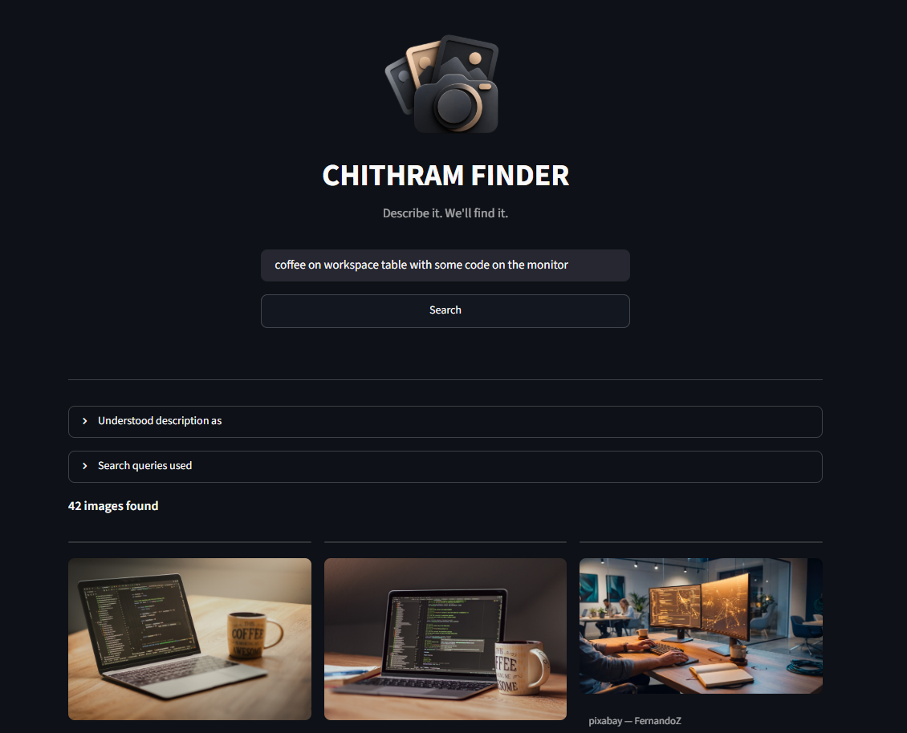

# Chithram Finder

*Chithram* (ചിത്രം) means "picture" in Malayalam.

Describe the image you want in plain English. Chithram Finder searches Pexels, Unsplash and Pixabay, removes duplicates, and ranks the results by how well they match your description.



## How it works

```
"a laptop showing a dashboard on a wooden desk"
        |
        v
Gemini breaks the description into structured fields and writes 3 search queries
        |
        v
Each query is searched on Pexels, then Unsplash, then Pixabay
        |
        v
Results are combined and duplicates removed
        |
        v
Jev ranks the images by relevance (keyword matching if Jev is unavailable)
        |
        v
Ranked image grid in the Streamlit app
```

The steps are nodes in a [LangGraph](https://langchain-ai.github.io/langgraph/) graph that share one state object. LangChain handles the language model calls. The image platform calls are plain `requests`.

## Features

- **Structured understanding.** Gemini returns a fixed schema (main subject, environment, device, screen content, style, queries) using structured output, so the response is reliably parseable.
- **Language model fallback.** If Gemini fails, the app tries a list of free OpenRouter models in order. The list is in `llm.py`.
- **Three image platforms** normalised into one `Image` type.
- **Deduplication** by platform and photo ID. The same photo found by different queries appears once, even when the platform puts different tracking data in its URL.
- **AI ranking.** [Jev](https://openrouter.ai/typesafe/jev-1.13) compares all image descriptions with your request in one call. If that fails, a keyword-overlap ranker takes over.
- **Visible failures.** Every network call has a timeout. If a platform fails, the app shows a warning and still returns results from the others.

## Project structure

```
chithram-finder/
├── app.py              # Streamlit web app
├── main.py             # Command-line version
├── graph.py            # LangGraph pipeline: state, nodes, wiring
├── llm.py              # Query generation: Gemini + OpenRouter fallback chain
├── search.py           # Runs queries on one platform, dedupes, collects errors
├── jev.py              # Jev ranking through OpenRouter
├── ranker.py           # Keyword-overlap ranker (fallback)
├── models.py           # Image dataclass and PlatformError
├── platforms/
│   ├── http_client.py  # Shared GET helper: timeout and error handling
│   ├── pexels.py
│   ├── unsplash.py
│   └── pixabay.py
├── assets/             # Logo and screenshot
├── requirements.txt
└── .env.example
```

## Setup

1. Create and activate a virtual environment:
   ```
   python -m venv venv
   venv\Scripts\activate        # Windows
   source venv/bin/activate     # macOS / Linux
   ```
2. Install the dependencies:
   ```
   pip install -r requirements.txt
   ```
3. Copy `.env.example` to `.env` and add your keys. The file lists where to get each one. All five are needed:

   | Key | Used for |
   |---|---|
   | `GEMINI_API_KEY` | Query generation |
   | `OPENROUTER_API_KEY` | Fallback language models and Jev ranking |
   | `PEXELS_API_KEY` | Pexels search |
   | `UNSPLASH_ACCESS_KEY` | Unsplash search |
   | `PIXABAY_API_KEY` | Pixabay search |

## Run

Web app:
```
streamlit run app.py
```

Command line:
```
python main.py
```

## Known limitations

- **The searches run one after another**, so a search takes a few seconds. Running the three platforms in parallel is on the to-do list.
- **Jev is new.** It runs on OpenRouter's alpha Decisions API, so its behaviour, availability and pricing may change. The keyword ranker is the safety net.
- **Free OpenRouter models change often.** If a fallback model stops working, update `FALLBACK_MODELS` in `llm.py`.
- **Unsplash demo keys allow 50 requests per hour.** One search makes 3 Unsplash requests.
- **Cross-platform duplicates.** The same photo uploaded to two platforms under different IDs is not detected.
- Check each platform's API terms before using results in a commercial project.

## To do

- [ ] Run the three platform searches in parallel
- [ ] Automated tests
- [ ] Cache repeated searches